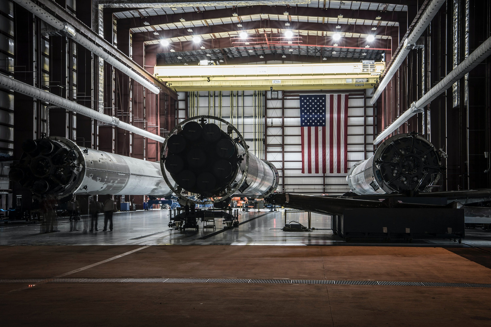

# Spaceship Titanic

## About
In this [Kaggle competition](https://www.kaggle.com/competitions/spaceship-titanic/data?select=test.csv) the task is to ***predict whether a passenger was transported to an alternate dimension*** during the Spaceship Titanic's collision with the spacetime anomaly. To help make these predictions, you're given a set of personal records recovered from the ship's damaged computer system.

## Data 
Target | Data Type | Description
:-- | :-- | :--
Transported | ether the passenger was transported to another dimension. This is the target, the column you are trying to predict.

Field | Data Type | Description
:-- | :-- | :--
PassengerId | Unique passender ID; takes the form gggg_pp *gggg indicates a group the passenger is travelling with, *pp is their number within the group*. People in a group are often family members, but not always.
HomePlanet | Planet passenger departed from, typically planet of residence.
CryoSleep | Whether the passenger elected suspended animation during voyage. Passengers in cryosleep are confined to their cabins.
Cabin | Cabin number where the passenger is staying. Takes the form deck/num/side, where side can be either P for Port or S for Starboard.
Destination | Planet passenger will be debarking to.
Age | Age of the passenger.
VIP | Whether passenger paid for VIP service during voyage.
RoomService, FoodCourt, ShoppingMall, Spa, VRDeck | Amount the passenger has billed at each amenity.
Name | First and last names of the passenger.

## Plan
### 00_planning
1. Read competition spec
2. Create Trello board
3. Create Github repository and initialize local git tracking

### 01_acquire
1. Save `train.csv` and `test.csv` files
2. Create working Juptyer Notebook and read data to Pandas DataFrame, noting any initial hypotheses and exploratory questions
3. Create `wrangle.py` file and `acquire` function to acquire and cache raw data (or read existing file)

### 02_wrangle
1. Look at data information (size, nulls, data types, column names, etc.) and determine any preliminary cleaning that needs to be done
2. Explore univariate distributions and determine if any additional cleaning steps (handling outliers, scaling variables, etc.) need to be performed prior to exploration
3. Perform any final cleaning/preparation (column names, feature engineering, etc.) before creating `wrangle` function and adding it to `wrangle.py` file

### 03_explore
1. Perform uni, bi, and multivariate anaylsis along with statistical testing to answer exploratory questions using Python Libraries and Tableau
2. Document takeaways, insights, and ideas for modeling
3. Create `explore.py` file and add explore function(s) 
3. Do any preparation necessary for modeling (feature selection, encoding cateorical features, etc.)

### 04_model
1. Create `model.py` module and add `preparation` function(s)
2. Research and select modeling algorithms 
3. Determine model evaluation metric and establish performance baseline 
4. Create predictions DataFrame using train data with baseline and model predictions

id | baseline | model_x | model_y | ...
:-- | :-- | :-- | :-- | :-- 
12345 | baseline_pred | model_x-pred | model_y_pred | ,,,

5. Use best performing model on train data and 
6. Create submission DataFrame from predictions DataFrame and write both to csv files. 

id | baseline
:-- | :-- 
456789 | model_pred

### 05_final
1. Create modeling function(s) and add to `model.py` module
2. Document model performance 
3. Establish platform to summarize work and communicate process, findings, takeaways, and/or recommendations and next steps (Jupyter Notebook, Google Slides, Tableau Story, Canva Graphics)
4. Test functions and modules and document steps to recreate

## Steps to Recreate